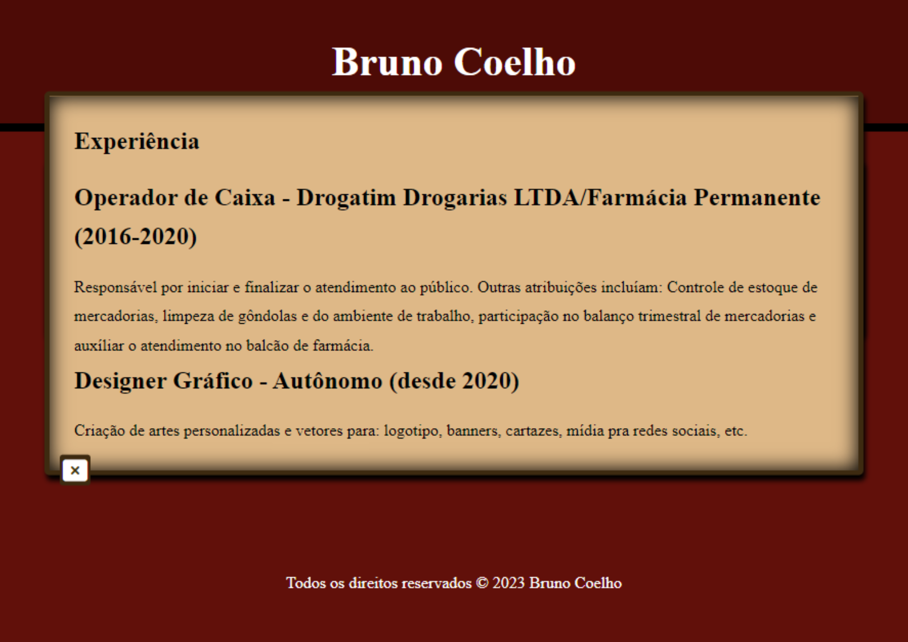

# Dev Bruno Coelho
## Desenvolvedor front-end e Designer Gráfico

Site pessoal utilizado como currículo virtual.

## Tecnologias Utilizadas
- HTML
- CSS
- JAVASCRIPT
- GIT

## Funcionalidades

- [x] Botões clicaveis
- [x] Popups com informações
- [x] Links para direcionamento para redes sociais
- [x] Animação com CSS e html2canvas
- [x] Slide de imagens
- [x] Formulário para obter informações e arquivos
- [x] Criação de um cartão de visitas
- [x] Otimização para touch em dispositivos móveis
- [x] Botões para download

## Layout

Destaque para os botões de imprimir e presente.
Experimente entrar no site e clique nestes botões para obter a experiência proporcionada pelo site.

A imagem acima foi editada apenas para demonstração.

### Página - Presente para Visitantes
 

## Demonstração
[Linke para o meu site](https://bminority.github.io/Dev_BrunoCoelho/)

## Autor
Bruno Celho Muniz Silva
[Linkedin](https://www.linkedin.com/in/bruno-coelho-97b630220/)